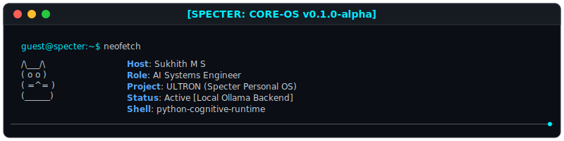

<!-- ====================================================== -->
<!-- AUTO-GENERATED FILE - DO NOT EDIT DIRECTLY            -->
<!-- Generated by profile-dashboard/generator              -->
<!-- ====================================================== -->

<div align="center">
  
</div>

<br />

<div align="center">
  
  # Sukhith M S
  
  [](https://git.io/typing-svg)

</div>

<br />

<div align="center">

```text
┌──────────────────────────────────────────────────────────┐
│                     SPECTER OS v2.0                      │
├──────────────────────────────────────────────────────────┤
│  USER      : SUKHITH M S                                  │
│  ROLE      : AI SYSTEMS ENGINEER                          │
│  STATUS    : ONLINE                                       │
│  PROJECT   : ULTRON                                       │
│  BRANCH    : GITHUB-PROFILE-V2                            │
│  COMMIT    : 2026-07-22 23:54 UTC                         │
└──────────────────────────────────────────────────────────┘
```

</div>

<br />

<table border="0" cellpadding="10" cellspacing="0" width="100%">
  <tr>
    <td valign="top" width="50%">
      <h3>🚀 Current Mission</h3>
      <p>Building <b>ULTRON</b>, A local-first, modular, personal AI operating system built from scratch with explicit lifecycle orchestration, telemetry, and capabilities.</p>
      <p><b>Status:</b> In Development</p>
    </td>
    <td valign="top" width="50%">
      <h3>🧠 Engineering Philosophy</h3>
      <ul>
        <li><b>Build from first principles.</b> Avoid framework bloat; construct every layer with intent.</li>
        <li><b>Understand every layer.</b> Dig deep into runtime behavior, memory management, and execution budgets.</li>
        <li><b>Automate what repeats.</b> Make automation a core system function, not a post-hoc convenience.</li>
      </ul>
    </td>
  </tr>
</table>

<br />

<table border="0" cellpadding="10" cellspacing="0" width="100%">
  <tr>
    <td valign="top" width="55%">
      <h3>🌐 Repository Ecosystem</h3>
      <pre>
          SPECTER ECOSYSTEM

                ULTRON
                   │
   ┌───────────────┼───────────────┐
   │               │               │
git_ai          CAPA        Krishi Setu
   │
   │
Developer Tooling
      </pre>
    </td>
    <td valign="top" width="45%">
      <h3>📅 System Roadmap</h3>
      <pre>
Year: 2026
Status: In Development

Sprint 1   : Complete
Sprint 2   : Complete
Sprint 3   : Complete
Sprint 4   : Building
Sprint 5   : Scheduled
Release    : Scheduled
      </pre>
    </td>
  </tr>
</table>

<br />

<table border="0" cellpadding="10" cellspacing="0" width="100%">
  <tr>
    <td valign="top" width="55%">
      <h3>🗒️ Live Development Journal</h3>
      <pre>
Today's Progress:
✓ Re-architected README layout into OS modules
✓ Created interactive HTML Command Console
✓ Implemented side-by-side repository health metrics
✓ Integrated ULTRON Architecture Mermaid model

Next:
- Custom SVG rendering pipeline
      </pre>
    </td>
    <td valign="top" width="45%">
      <h3>🤖 AI Agent Architecture</h3>
      <pre>
Target Agents:
• Planner Agent      [In Development]
• Memory Agent       [In Development]
• Reasoner Agent     [In Development]
• Executor Agent     [In Development]
      </pre>
    </td>
  </tr>
</table>

<br />

### 🧠 ULTRON Core Architecture

```mermaid
graph TD
  classDef default fill:#0b0e14,stroke:#30363d,stroke-width:1px,color:#c9d1d9;
  classDef active fill:#0b0e14,stroke:#00f0ff,stroke-width:2px,color:#00f0ff;
  CAPA[CAPA]:::default
  Developer Tooling[Developer Tooling]:::default
  Krishi_Setu[Krishi-Setu]:::default
  ULTRON[ULTRON]:::default
  git_ai[git_ai]:::default
  ULTRON --> CAPA
  ULTRON --> Krishi_Setu
  ULTRON --> git_ai
  git_ai --> Developer Tooling
  class ULTRON active;
```

<br />

## 🧪 Repository Health Matrix

<table border="0" cellpadding="10" cellspacing="0" width="100%">
  <tr>
    <td valign="top" width="50%">
      <h4>🧠 ULTRON</h4>
      <pre>
Version    : In Development
Status     : ACTIVE DEVELOPMENT
Tests      : N/A
Coverage   : N/A
Deployment : Local
      </pre>
      <a href="https://github.com/sukhithms25/ULTRON"><b>Explore ULTRON »</b></a><br />
      [](#)
    </td>
    <td valign="top" width="50%">
      <h4>🤖 git_ai</h4>
      <pre>
Version    : N/A
Status     : In Development
Tests      : N/A
Coverage   : N/A
Deployment : N/A
      </pre>
      <a href="https://github.com/sukhithms25/git_ai"><b>Explore git_ai »</b></a><br />
      [](#)
    </td>
  </tr>
  <tr>
    <td valign="top" width="50%">
      <h4>⚡ CAPA</h4>
      <pre>
Version    : N/A
Status     : In Development
Tests      : N/A
Coverage   : N/A
Deployment : N/A
      </pre>
      <a href="https://github.com/sukhithms25/CAPA"><b>Explore CAPA »</b></a><br />
      [](#)
    </td>
    <td valign="top" width="50%">
      <h4>🌾 Krishi-Setu</h4>
      <pre>
Version    : N/A
Status     : In Development
Tests      : N/A
Coverage   : N/A
Deployment : N/A
      </pre>
      <a href="https://github.com/sukhithms25/Krishi-Setu"><b>Explore Krishi-Setu »</b></a><br />
      [](#)
    </td>
  </tr>
</table>

<br />

## 📡 Tech Radar

<table border="0" cellpadding="10" cellspacing="0" width="100%">
  <tr>
    <td valign="top" width="33%">
      <h4>🟢 Learning</h4>
      <ul>
        <li>Go</li>
        <li>Rust</li>
        <li>Kubernetes</li>
      </ul>
    </td>
    <td valign="top" width="33%">
      <h4>🔵 Building</h4>
      <ul>
        <li>Python</li>
        <li>FastAPI</li>
        <li>React</li>
      </ul>
    </td>
    <td valign="top" width="33%">
      <h4>🟣 Mastered</h4>
      <ul>
        <li>Git</li>
        <li>Docker</li>
        <li>PostgreSQL</li>
      </ul>
    </td>
  </tr>
</table>

<br />

## 📊 Kernel Statistics

<div align="center">
  <table border="0" cellpadding="0" cellspacing="0" width="100%">
    <tr>
      <td valign="top" width="50%">
        
      </td>
      <td valign="top" width="50%">
        
      </td>
    </tr>
  </table>
</div>

<br />

## ⌨️ Command Console

<pre>
guest@specter:~$ <a href="https://github.com/sukhithms25/ULTRON/tree/main/specter-rfcs">system status</a>
Kernel: Active | Cognitive Budget: 92% | Logs: Normal

guest@specter:~$ <a href="mailto:sukhithms2003@gmail.com">whoami</a>
User: Sukhith M S | Role: AI Systems Engineer | Status: Ready

guest@specter:~$ <a href="https://github.com/sukhithms25?tab=repositories">ls</a>
bin/  ultron/  git_ai/  capa/  krishi-setu/
</pre>

<br />

## 🔌 Connection Ports

<div align="center">

[](mailto:sukhithms2003@gmail.com)
&nbsp;&nbsp;&nbsp;&nbsp;
[](https://linkedin.com/in/sukhith-m-s)
&nbsp;&nbsp;&nbsp;&nbsp;
[](#)

</div>
